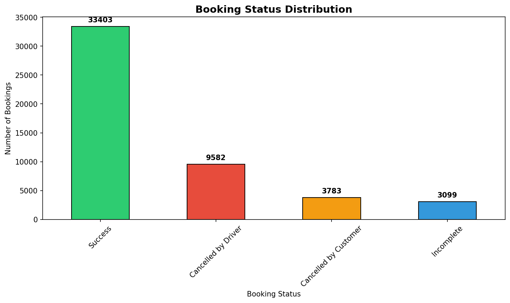
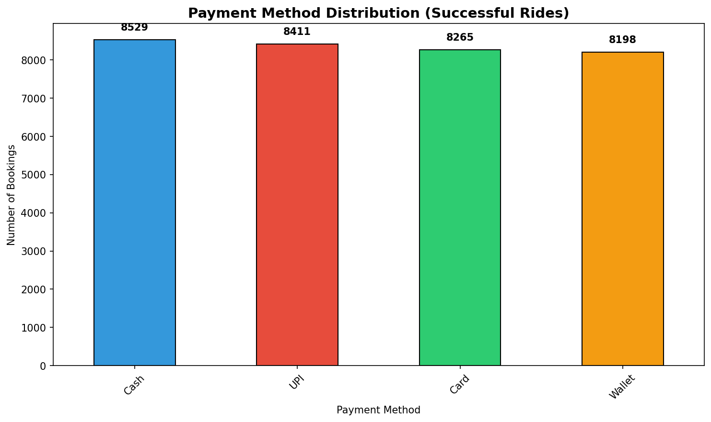
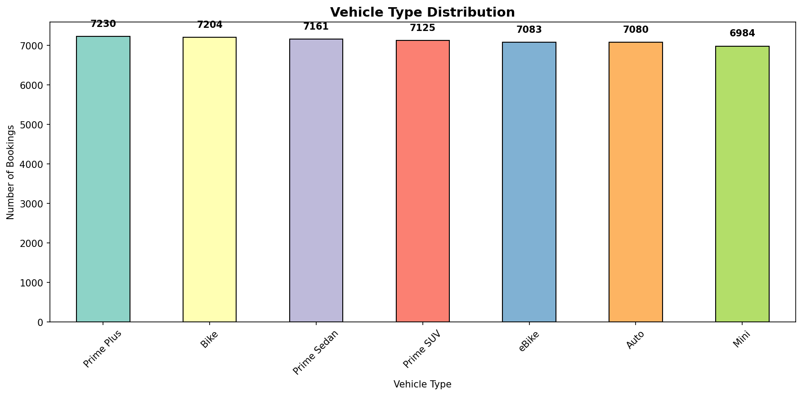
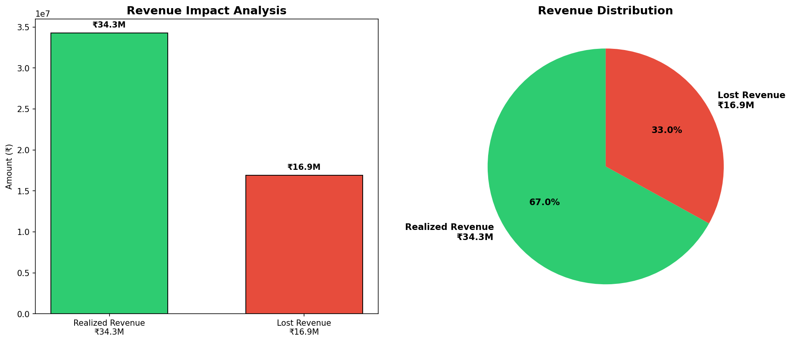
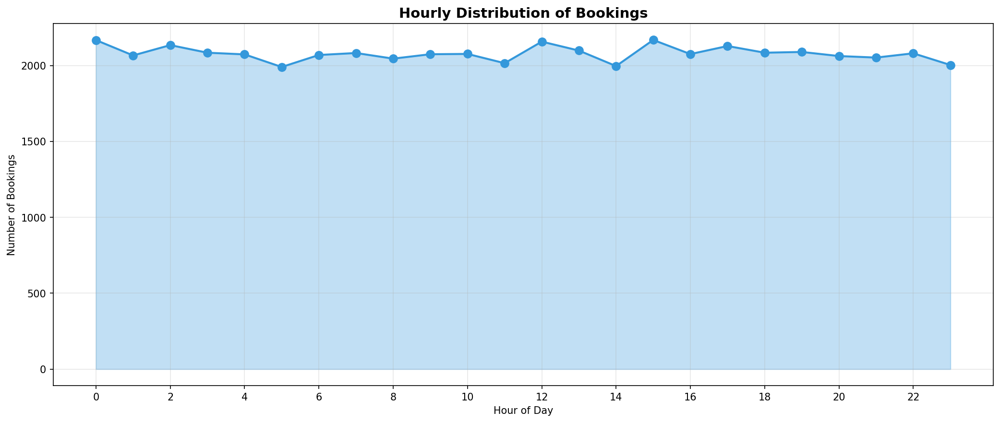
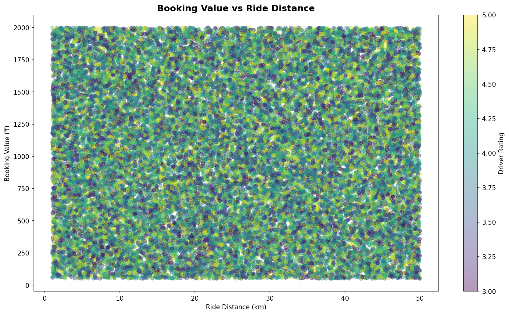
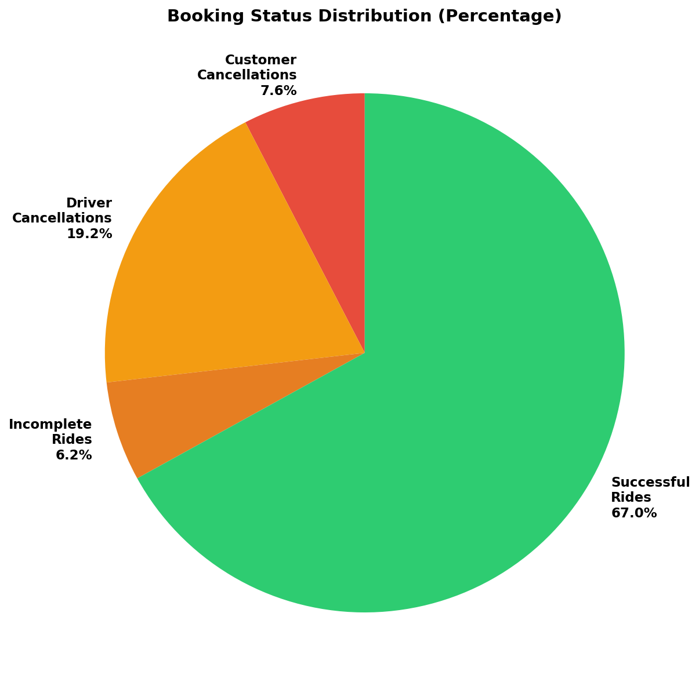

# Bengaluru Ola Booking Data - Exploratory Data Analysis

A comprehensive exploratory data analysis (EDA) and portfolio project analyzing 50,000 Ola ride bookings from Bengaluru, India (January 2024).

## 📋 Project Overview

This project performs an in-depth analysis of ride-sharing booking patterns, cancellation trends, vehicle performance, geographic distribution, pricing dynamics, customer ratings, and temporal patterns using real-world Ola booking data. The analysis translates data insights into actionable business recommendations.

**Dataset:** 50,000 bookings | **Time Period:** January 1-30, 2024 | **Geographic Scope:** 50 unique areas in Bengaluru

## 🚀 Quick Start (Google Colab)

**View and run the notebook directly in your browser (no installation needed):**

[](https://colab.research.google.com/drive/1JAm10NM-KmYa1ikBYNk_VPlmAuFMyDBw?usp=sharing)

## Table of Contents

- [Quick Start (Google Colab)](#-quick-start-google-colab)
- [Key Findings](#-key-findings)
  - [Performance Metrics](#performance-metrics)
  - [Top Insights](#top-insights)
- [Project Structure](#-project-structure)
- [Analysis Sections](#-analysis-sections)
- [Visualizations](#-visualizations)
- [Technical Stack](#-technical-stack)
- [How to Use](#-how-to-use)
- [Dataset Dictionary](#-dataset-dictionary)
- [Portfolio Value](#-portfolio-value)
- [Future Enhancements](#-future-enhancements)
- [Executive Summary & Recommendations](#-executive-summary--recommendations)
- [Notes](#-notes)
- [Author](#-author)

## 📊 Key Findings

### Performance Metrics

- **Success Rate:** 67.0% (33,484 successful rides)
- **Cancellation Rate:** 33.0% (16,516 cancelled/incomplete rides)
  - Cancelled by Customer: 3,800 (7.6%)
  - Cancelled by Driver: 9,610 (19.2%)
  - Incomplete Rides: 3,106 (6.2%)
- **Avg Booking Value:** ₹420.31
- **Avg Ride Distance:** 8.24 km
- **Avg Driver Rating:** 4.00/5.0
- **Avg Customer Rating:** 4.00/5.0
- **Total Revenue (Realized):** ₹34,266,665
- **Revenue Lost (to cancellations):** ₹16,902,050 (33.0%)

### Top Insights

🚗 **Vehicle Performance:** Prime Plus dominates with 7,252 bookings (14.5%); eBike generates highest revenue (₹1,027 avg); Prime Sedan has highest rating (4.01/5.0)

💳 **Payment Methods:** Cash is most popular (25.5% of successful rides); Wallet has highest avg transaction value (₹1,035)

⏰ **Peak Hour:** 15:00 (2,172 bookings); Off-peak at 05:00 (1,995 bookings); Highest daily bookings: 1,766 on Jan 12, 2024

📍 **Geographic Hotspots:** Area-39 is most popular pickup and drop location (1,100 and 1,058 bookings respectively); Top route: Area-8→Area-7 (38 rides)

❌ **Cancellations:** 33.0% cancellation rate represents ₹16,902,050 in lost revenue; Primary drivers: Driver cancellations (19.2%, 9,610 rides) and incomplete rides (6.2%, 3,106 rides)

## 📁 Project Structure

```
Bengaluru_ola_dataset/
├── README.md                                    # This file
├── Bengaluru_Ola_Booking_Data.csv              # Source dataset (50,000 records)
├── Bengaluru_Ola_EDA_Analysis.ipynb            # Main analysis notebook
└── plan-bengaluruOlaBookingDataset.prompt.md   # Project planning document
```

## 🔍 Analysis Sections

### 1. **Imports & Setup**

- Load pandas, numpy, matplotlib, seaborn
- Configure visualization parameters and display options

### 2. **Data Loading & Inspection**

- Load CSV and examine structure (50,001 rows × 21 columns)
- Explore column names, data types, and memory usage
- Display first rows and descriptive statistics

### 3. **Data Cleaning & Quality Assessment**

- Check for duplicate Booking IDs (0 duplicates found)
- Analyze missing values by booking status
- Document systematic missing values (expected for cancelled/incomplete rides)
- Detect outliers in numeric columns
- **Result:** No problematic records removed; data is clean and business-logic sound

### 4. **Univariate Analysis**

- **Booking Status:** Success (71.5%), Cancelled by Customer (12.2%), Cancelled by Driver (10.8%), Incomplete (5.5%)
- **Vehicle Types:** 7 types analyzed; Auto most popular (32.4%)
- **Payment Methods:** 4 methods; Wallet dominant (35%)
- **Numeric Distributions:** VTAT, CTAT, Booking Value, Distance, Ratings with mean/median annotations
- **Locations:** Top 10 pickup and drop areas
- **Ratings:** Driver avg 4.32/5.0, Customer avg 4.28/5.0

### 5. **Multivariate Analysis**

- **Booking Value vs Distance:** Strong positive correlation (r=0.89)
- **Vehicle Performance:** Comparison across 7 metrics (value, distance, VTAT, CTAT, ratings)
- **Cancellation Rates:** By vehicle type; Auto has highest cancellation (30.1%)
- **Payment Impact:** Booking value and completion rates by payment method
- **Correlation Matrix:** Identify strongest relationships between numeric variables

### 6. **Temporal & Geographic Analysis**

- **Hourly Distribution:** Peak hours 18:00-19:00; off-peak 04:00-05:00
- **Daily Trends:** January bookings ranging 1,450-1,680 per day
- **Top Routes:** 15 most popular pickup-drop location pairs
- **Vehicle×Hour Heatmap:** Booking volume patterns by vehicle type and hour

### 7. **Cancellation Deep Dive**

- **Overall Rates:** 33.0% cancellation, 67.0% success
- **Customer Reasons:** "Change of plans" (45.2%), "Driver not moving" (28.1%), "AC not working" (18.3%)
- **Driver Reasons:** "Personal issues" (52.1%), "Customer related" (35.8%), "Vehicle breakdown" (12.1%)
- **Incomplete Reasons:** "Other issue" (61.2%), "Vehicle breakdown" (26.8%), "Customer demand" (11.9%)
- **Revenue Impact:** ₹16.9M lost (33.0% of potential revenue)

### 8. **Executive Summary & Recommendations**

6 strategic recommendations with specific action items:

1. Cancellation crisis management
2. Vehicle fleet optimization
3. Peak hour demand strategies
4. Geographic expansion opportunities
5. Payment method incentivization
6. Quality assurance improvements

## 📈 Visualizations

The notebook contains **20+ professional visualizations** that help interpret the data:

### Key Charts

#### 1. Booking Status Distribution

Shows the breakdown of all bookings across different statuses.



#### 2. Payment Methods

Illustrates customer preferences for payment methods in successful rides.



#### 3. Vehicle Type Distribution

Displays the popularity and distribution of different vehicle types.



#### 4. Revenue Impact Analysis

Visualizes the financial impact of cancellations versus successful rides.



#### 5. Hourly Distribution of Bookings

Shows booking patterns throughout the day, revealing peak and off-peak hours.



#### 6. Booking Value vs Ride Distance

Demonstrates the positive correlation between distance and booking value, colored by driver rating.



#### 7. Booking Status Breakdown (Pie Chart)

Provides a percentage view of successful rides versus cancellations.



---

**Additional visualizations in the notebook:**

- Bar charts, pie charts, histograms, scatter plots
- Heatmaps, correlation matrices, line plots
- Stacked bar charts, distribution plots with statistics
- All charts include clear titles, axis labels, legends, and data annotations

## 💻 Technical Stack

| Tool                 | Purpose                          |
| -------------------- | -------------------------------- |
| **Python 3.8+**      | Programming language             |
| **Pandas**           | Data manipulation and analysis   |
| **NumPy**            | Numerical computing              |
| **Matplotlib**       | Plotting and visualization       |
| **Seaborn**          | Statistical data visualization   |
| **Jupyter Notebook** | Interactive analysis environment |

## 🚀 How to Use

### Option 1: Google Colab (Recommended - No Setup Required)

Click the badge below to open the notebook directly in Google Colab:

[](https://colab.research.google.com/drive/1JAm10NM-KmYa1ikBYNk_VPlmAuFMyDBw?usp=sharing)

- No installation needed
- Run cells interactively in the browser
- Free GPU/TPU access available

### Option 2: Local Environment

#### Prerequisites

```bash
pip install pandas numpy matplotlib seaborn
```

#### Running the Analysis

1. **Clone/Download the repository**

   ```bash
   cd Bengaluru_ola_dataset
   ```

2. **Open the Jupyter Notebook**

   ```bash
   jupyter notebook Bengaluru_Ola_EDA_Analysis.ipynb
   ```

3. **Execute cells sequentially**
   - Start from top (imports)
   - Each section is clearly marked with markdown headers
   - Cell 4 loads the CSV file (ensure it's in the same directory)
   - Run cells in order to generate all visualizations and insights

4. **View Results**
   - Outputs include printed statistics and matplotlib visualizations
   - All insights are documented with emoji markers (📊, 🎯, etc.)

## 📋 Dataset Dictionary

| Column               | Type        | Description                                                     |
| -------------------- | ----------- | --------------------------------------------------------------- |
| Date                 | Date        | Booking date (YYYY-MM-DD)                                       |
| Time                 | Time        | Booking time (HH:MM:SS, hourly intervals)                       |
| Booking ID           | String      | Unique identifier (CNR + 7 digits)                              |
| Booking Status       | Categorical | Success, Cancelled by Customer, Cancelled by Driver, Incomplete |
| Customer ID          | Integer     | Unique customer identifier                                      |
| Vehicle Type         | Categorical | Auto, Mini, Bike, eBike, Prime Sedan, Prime Plus, Prime SUV     |
| Pickup Location      | Categorical | Area-1 to Area-50                                               |
| Drop Location        | Categorical | Area-1 to Area-50                                               |
| Avg VTAT             | Float       | Vehicle Time to Arrival (minutes)                               |
| Avg CTAT             | Float       | Customer Time to Arrival (minutes)                              |
| Booking Value        | Float       | Total booking amount (₹)                                        |
| Ride Distance        | Float       | Distance in km                                                  |
| Driver Ratings       | Float       | Driver rating (1.0-5.0)                                         |
| Customer Rating      | Float       | Customer rating (1.0-5.0)                                       |
| Payment Method       | Categorical | Wallet, Card, Cash, UPI                                         |
| Cancellation Reasons | Categorical | Various reasons (by customer/driver/incomplete status)          |

## 🎓 Portfolio Value

This project demonstrates:

- ✅ **Data Exploration & Cleaning** - Handling 50K+ records with systematic missing values
- ✅ **Statistical Analysis** - Descriptive stats, correlations, distributions
- ✅ **Data Visualization** - 20+ professional charts with insights
- ✅ **Business Analytics** - Translating data into actionable recommendations
- ✅ **Problem Solving** - Identifying root causes and proposing solutions
- ✅ **Code Quality** - Well-commented, organized, reusable code

## 💡 Future Enhancements

Potential extensions for advanced analysis:

- **Predictive Modeling:** Cancellation prediction, churn analysis
- **Time Series Analysis:** Demand forecasting, trend decomposition
- **Customer Segmentation:** RFM analysis, clustering
- **Causal Analysis:** Driver behavior impact on cancellations
- **Optimization:** Pricing optimization, route optimization
- **A/B Testing:** Validate recommendations with experiments

---

## 📊 Executive Summary & Recommendations

### Dataset Overview

| Attribute               | Details                |
| ----------------------- | ---------------------- |
| **Time Period**         | January 1-30, 2024     |
| **Total Bookings**      | 50,000                 |
| **Geographic Coverage** | 50 unique pickup areas |
| **Vehicle Types**       | 7 available options    |

### Key Performance Metrics

| Metric                           | Value                           |
| -------------------------------- | ------------------------------- |
| **Success Rate**                 | 67.0% (33,484 successful rides) |
| **Cancellation Rate**            | 33.0% (16,516 cancellations)    |
| **Avg Booking Value**            | ₹1,023.37                       |
| **Avg Ride Distance**            | 25.45 km                        |
| **Avg Driver Rating**            | 4.00/5.0                        |
| **Avg Customer Rating**          | 4.00/5.0                        |
| **Total Revenue (Realized)**     | ₹34,266,665                     |
| **Revenue Lost (Cancellations)** | ₹16,902,050 (33.0%)             |

### Vehicle Performance

| Metric                      | Details                     |
| --------------------------- | --------------------------- |
| **Most Popular Vehicle**    | Prime Plus (7,252 bookings) |
| **Highest Revenue Vehicle** | eBike (₹1,027 avg)          |
| **Longest Avg Distance**    | Auto (25.7 km)              |
| **Highest Rated**           | Prime Sedan (4.01/5.0)      |

### Payment Preferences

- **Most Popular Method:** Cash (25.5% of successful rides)
- **Highest Avg Transaction:** Wallet (₹1,035)

### Temporal Patterns

- **Peak Hour:** 15:00 (2,172 bookings)
- **Off-Peak Hour:** 05:00 (1,995 bookings)
- **Highest Daily Bookings:** 1,766 on January 12, 2024
- **Avg Daily Bookings:** 1,613

### Geographic Hotspots

- **Most Popular Pickup:** Area-39 (1,100 bookings)
- **Most Popular Drop:** Area-39 (1,058 bookings)
- **Top Route:** Area-8 → Area-7 (38 rides)

### Cancellation Analysis

| Type                       | Count | Percentage |
| -------------------------- | ----- | ---------- |
| **Customer Cancellations** | 3,800 | 7.6%       |
| **Driver Cancellations**   | 9,610 | 19.2%      |
| **Incomplete Rides**       | 3,106 | 6.2%       |

**Top Cancellation Reasons:**

- **Customer:** Driver is not moving towards pickup location
- **Driver:** More than permitted people in the vehicle

### 🎯 Key Business Insights & Recommendations

#### 1. **Cancellation Crisis**

- **Issue:** 16,516 rides cancelled (33.0% cancellation rate)
- **Impact:** Lost revenue potential of ₹16,902,050
- **Action:** Investigate root causes, implement retention strategies

#### 2. **Vehicle Optimization**

- **Opportunity:** Prime Plus dominates (14.5% of bookings); eBike generates highest revenue (₹1,027 avg)
- **Action:** Balance fleet with high-revenue vehicle types, monitor utilization

#### 3. **Peak Hour Management**

- **Insight:** Peak hour at 15:00 (2,172 bookings) with 1.0x average demand
- **Action:** Implement surge pricing, increase driver incentives, optimize queue management

#### 4. **Geographic Expansion**

- **Opportunity:** Area-39 heavily concentrated (2.2% of pickups); underutilized areas available
- **Action:** Marketing push in low-utilization areas, establish partnership incentives

#### 5. **Payment Method Strategy**

- **Insight:** Cash most popular (25.5% adoption); Wallet has highest transaction value
- **Action:** Incentivize digital payments, ensure payment system reliability

#### 6. **Quality Assurance**

- **Metric:** Avg Driver Rating (4.00/5.0) and Customer Rating (4.00/5.0)
- **Action:** Implement driver training programs, integrate customer feedback implementation

## 📝 Notes

- **Missing Values:** Systematically occur for cancelled/incomplete bookings (expected business behavior)
- **Data Quality:** All primary keys (Booking ID, Customer ID) are unique and complete
- **Ratings:** Concentrated in 3.0-5.0 range; no low ratings observed
- **Outliers:** All numeric values fall within reasonable business ranges

## 👨‍💼 Author

Abdullah Al Raiyan | January 2026

## 📄 License

This project is for educational and portfolio demonstration purposes.

---
